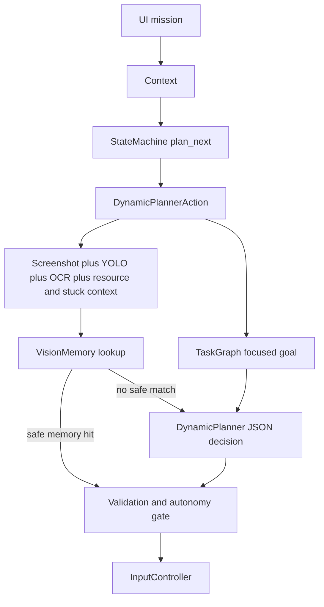
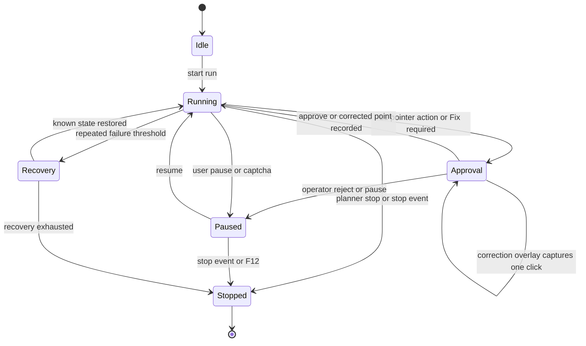

# OSROKBOT

OSROKBOT is a guarded, agentic Windows automation system for **Rise of
Kingdoms**. The current runtime is built around a PyQt control overlay,
window screenshots, optional YOLO UI detection, OCR, OpenAI Responses API
planning, local visual memory, and Oblita Interception hardware input.

This is no longer a root-level image-template bot. The supported runtime path is:

```text
UI mission
  -> Context
  -> StateMachine(plan_next)
  -> DynamicPlannerAction
  -> TaskGraph focused goal
  -> screenshot + YOLO + OCR + resource context + stuck-screen context
  -> VisionMemory lookup
  -> DynamicPlanner JSON decision
  -> validation + autonomy/approval
  -> InputController
```

> [!WARNING]
> OSROKBOT can move the real mouse and press real keys through a
> hardware-level input driver. Install and test it conservatively. Start with
> `L1 approve` for new missions, new YOLO weights, new memory, or any code
> change that can affect input.

## Contents

- [Current Runtime](#current-runtime)
- [Planner Contract](#planner-contract)
- [Architecture Map](#architecture-map)
- [Runtime Diagrams](#runtime-diagrams)
- [Documentation Standard](#documentation-standard)
- [Operational Runbooks](#operational-runbooks)
- [Architecture Decision Records](#architecture-decision-records)
- [Safety Model](#safety-model)
- [Requirements](#requirements)
- [Setup](#setup)
- [Configuration](#configuration)
- [Running OSROKBOT](#running-osrokbot)
- [Corrections And Memory](#corrections-and-memory)
- [Watchdog](#watchdog)
- [Runtime Data](#runtime-data)
- [Media Policy](#media-policy)
- [Development Rules](#development-rules)
- [Verification](#verification)
- [Troubleshooting](#troubleshooting)

## Current Runtime

OSROKBOT executes one guarded planner step at a time.

1. `Classes/UI.py` collects a plain-English mission, builds the production
   runtime dependencies, and creates a per-run `Context`.
2. `Classes/action_sets.py` builds the supported `dynamic_planner()` state
   machine from the startup-provided action factory.
3. `Classes/OS_ROKBOT.py` runs the machine through an executor-backed loop,
   writes heartbeat data, checks foreground state, captures one shared
   observation per loop, and pauses on CAPTCHA-like detector labels.
4. `Classes/Actions/dynamic_planner_action.py` orchestrates four helper
   services: observation, approval, execution, and feedback.
5. `Classes/vision_memory.py` tries to reuse a successful local visual match
   before spending an OpenAI call.
6. `Classes/dynamic_planner.py` sends planner requests through a dedicated
   async Responses API transport when memory has no safe match and validates
   the strict JSON response.
7. `DynamicPlannerAction` resolves target IDs to current screen geometry,
   applies the autonomy policy, records corrections or failures, and sends any
   hardware input through `Classes/input_controller.py`.

The active action package exposes only the base `Action` contract and
`DynamicPlannerAction`. Historical gameplay-template actions are quarantined
under `Classes/Actions/legacy/` for reference only; new runtime behavior must
enter through `ActionSets.dynamic_planner()`. Legacy root-level gameplay
templates under `Media/` are deprecated.

## Planner Contract

`dynamic_planner.py` is side-effect free. It can propose a decision; it must
not move the mouse, press keys, write memory, or change game state.

The model-facing schema accepts these fields:

```json
{
  "thought_process": "short debug note",
  "action_type": "click",
  "target_id": "det_3",
  "label": "target label",
  "confidence": 0.9,
  "delay_seconds": 1.0,
  "reason": "short user-facing reason",
  "end_target_id": "",
  "key_name": "",
  "text_content": "",
  "drag_direction": ""
}
```

The model may reference current detector/OCR target IDs, but it must not return
raw `x` or `y` coordinates. `DynamicPlanner.resolve_target_decision(...)`
resolves target IDs to normalized coordinates after schema validation.
Planner networking is handled behind a dedicated async transport, but the
planner API used by the rest of the runtime remains synchronous.

Supported actions:

| Action | Required Fields | Runtime Behavior |
| --- | --- | --- |
| `click` | `target_id` | Click the current detector/OCR target center after bounds validation. |
| `drag` | `target_id` plus `end_target_id` or `drag_direction` | Drag from a current target to another target or in a named direction. |
| `long_press` | `target_id` | Hold the current target for a short randomized duration. |
| `key` | `key_name` | Press a supported keyboard key through `InputController`. |
| `type` | `text_content` | Type text one character at a time through `InputController`. |
| `wait` | none | Wait for `delay_seconds`, then observe again. |
| `stop` | none | Stop the current automation run. |

Safety validation rejects unsupported action types, unknown target IDs,
low-confidence input actions, non-finite coordinates, coordinates outside
`0.0..1.0`, and planner delays outside the bounded range.

Current approval behavior is implemented for pointer-target actions:
`click`, `drag`, and `long_press`. `key` and `type` decisions still pass
planner validation and `InputController` pause/foreground/backend guards, but
they do not use the target approval prompt.

## Architecture Map

| Module | Responsibility |
| --- | --- |
| `Classes/UI.py` | PyQt Agent Supervisor Console view: shell layout, theming, tabs, state-responsive collapse/expand behavior, tray notifications, and overlay presentation. |
| `Classes/UIController.py` | View-model/controller for mission history, autonomy selection, session logging, planner approval state, YOLO warmup, and per-run `Context` creation. |
| `Classes/click_overlay.py` | Non-blocking planner target preview overlay plus the blocking crosshair correction overlay used by `Fix`. |
| `Classes/context.py` | Thread-guarded shared runtime state, per-step observation cache, planner approval payloads, state history, resource cache, UI anchors, and signal access. |
| `Classes/action_sets.py` | Supported workflow factory. `dynamic_planner()` is the current runtime entry point. |
| `Classes/state_machine.py` | Deterministic action runner, preconditions, transition history, diagnostics, and tiered global recovery. |
| `Classes/runtime_contracts.py` | Shared Protocols and type aliases for state-machine actions, detector/OCR providers, and window-capture boundaries. |
| `Classes/runtime_payloads.py` | Shared TypedDict payloads for heartbeat, planner approval, recovery handoff, state history, and resource context. |
| `Classes/artifact_retention.py` | Shared retention policies for diagnostics, session logs, and recovery dataset exports. |
| `Classes/run_handoff.py` | Canonical per-run artifact builder for runtime sessions and maintainer commands, latest-run handoff refresh, incomplete-run reconciliation, and test-artifact cleanup helpers. |
| `Classes/OS_ROKBOT.py` | Executor-backed run loop, injectable runtime services, pause/stop events, foreground guard, shared observation reuse, CAPTCHA pause, heartbeat lifecycle, state-machine cleanup, and emergency-stop startup. |
| `Classes/Actions/dynamic_planner_action.py` | Planner-step orchestration that composes observation, approval, feedback, and guarded execution services. |
| `Classes/Actions/dynamic_planner_services.py` | Planner observation, approval, execution, and feedback services used by `DynamicPlannerAction`. |
| `Classes/Actions/legacy/` | Deprecated template actions retained outside the supported runtime and excluded from static cleanup gates. |
| `Classes/dynamic_planner.py` | Async OpenAI Responses transport, strict JSON schema validation, target resolution, retry handling, memory-first decision selection, and decision validation. |
| `Classes/task_graph.py` | One-time mission decomposition into sub-goals, cached per mission, with label/OCR post-condition tracking. |
| `Classes/object_detector.py` | YOLO detector adapter and no-op fallback when weights are absent or unavailable. |
| `Classes/ocr_service.py` | Configurable OCR engine order, bounded Tesseract text/region fallback, and normalized OCR targets. |
| `Classes/state_monitor.py` | Coarse game-state classification, blocker clearing, idle march-slot OCR, action-point OCR, and explicit client restart support. |
| `Classes/screen_change_detector.py` | Perceptual-hash screen change checks and repeated-action warnings for the planner prompt. |
| `Classes/vision_memory.py` | CLIP embeddings, FAISS or NumPy similarity search, bounded atomic persistence, duplicate-success merging, success/failure memory, corrections, and trusted-label checks. |
| `Classes/recovery_memory.py` | Bounded atomic persistence for guarded AI recovery outcomes keyed by state/action/screen signatures. |
| `Classes/input_controller.py` | The only allowed hardware input path. It owns Interception readiness, pause/stop checks, foreground checks, bounds validation, bounded humanization, mouse movement, clicks, drags, long presses, keys, scrolls, and waits. |
| `Classes/window_handler.py` | Foreground enforcement, client-rect discovery, and named capture backend selection with Win32 PrintWindow/BitBlt as the current default. |
| `Classes/model_manager.py` | Local YOLO weight discovery and optional HTTPS download from `ROK_YOLO_WEIGHTS_URL` with timeout, streaming, and size-cap enforcement. |
| `Classes/security_utils.py` | Secret redaction, atomic text writes, and dotenv updates for sensitive local configuration. |
| `Classes/detection_dataset.py` | Planner no-decision stubs and correction export for detector training data. |
| `Classes/session_logger.py` | Runtime session wrapper over the shared run-handoff contract. |
| `Classes/maintainer_run.py` | Maintainer command wrapper that captures stdout/stderr, emits deterministic milestone lines, and keeps pytest artifacts under one ignored root. |
| `Classes/emergency_stop.py` | F12 process-level emergency termination. |
| `watchdog.py` | Conservative heartbeat monitor and tracked-process restart helper. |
| `verify_docs.py` | Lightweight documentation artifact and linkage verification. |

## Runtime Diagrams

### Planner Workflow



### Run And Recovery States



When runtime flow, approval gating, or recovery behavior changes, update these
diagrams in the same change.

## Documentation Standard

OSROKBOT uses Google-style docstrings for the supported planner-first runtime.

- Add a module docstring to files that define orchestration, safety,
  concurrency, or persistence boundaries.
- Public classes should document ownership, collaborators, invariants, and
  side-effect limits.
- Non-trivial public methods should document `Args`, `Returns`, and `Raises`.
  Add `Threading` or `Side Effects` when the method owns background work,
  locks, subprocesses, or hardware input boundaries.
- Keep documentation scoped to the supported runtime only. Deprecated modules
  under `Classes/Actions/legacy/` can be referenced as history, not as active
  architecture.
- `Classes/dynamic_planner.py` and `Classes/state_machine.py` are the
  canonical examples for planner and workflow documentation in this
  repository.

Example:

```python
class DynamicPlanner:
    """Plan one side-effect-free automation step from current observation data.

    Collaborators:
        VisionMemory provides memory-first reuse before an OpenAI request.

    Invariants:
        - Never executes hardware input.
        - Never returns raw model coordinates.
        - Never mutates UI or game state.
    """
```

Before handoff, use `docs/documentation-review-checklist.md` to confirm that
the user guide, maintainer contract, capability index, diagrams, runbooks, and
ADRs still match the changed behavior.

## Operational Runbooks

Operator runbooks live under `docs/runbooks/` and are part of the maintained
documentation surface:

- `docs/runbooks/watchdog-restart.md`: heartbeat monitoring and conservative
  restart behavior.
- `docs/runbooks/captcha-manual-recovery.md`: required human handling when
  CAPTCHA detection pauses automation.
- `docs/runbooks/emergency-stop.md`: F12 termination and recovery expectations.
- `docs/runbooks/secret-provisioning.md`: local `.env` provisioning and
  workstation-grade secret handling limits.
- `docs/runbooks/failure-triage.md`: first-pass investigation for stalled or
  degraded runs.
- `docs/runbooks/run-handoff.md`: how operators and AI agents should read the
  canonical latest-run handoff files.

Update the affected runbook in the same change whenever setup, restart,
CAPTCHA, emergency-stop, secret handling, diagnostics, telemetry, or triage
behavior changes.

## Architecture Decision Records

Accepted architecture decisions live under `docs/adr/`:

- `docs/adr/0001-planner-first-runtime.md`: the supported planner-first runtime
  and legacy action quarantine.
- `docs/adr/0002-human-in-the-loop-safety.md`: autonomy levels, approval
  behavior, and CAPTCHA pause policy.

Add or amend an ADR when changing the production runtime path, safety model,
input boundary, memory strategy, or operational contract.

## Safety Model

### Autonomy Levels

| Level | UI Label | Behavior |
| --- | --- | --- |
| L1 | `L1 approve` | `click`, `drag`, and `long_press` wait for human approval. The overlay shows current YOLO detector boxes, the selected target, and an intent tooltip. `Fix` opens a blocking crosshair overlay over the game client and waits indefinitely for one corrected click. When detector boxes are unavailable on a gather/resource mission, the planner can surface an OCR-only `Fix required` target instead of stopping. Use this by default. |
| L2 | `L2 trusted` | Pointer actions with locally trusted labels can execute after enough clean successes. New or failed labels still require approval. |
| L3 | `L3 auto` | Validated pointer actions can execute without approval. Use only for stable, supervised workflows. |

The trusted-label threshold defaults to `3` clean successes and can be adjusted
with `PLANNER_TRUSTED_SUCCESS_COUNT`.

### Input Guardrails

All hardware input must go through `InputController`. Before input is sent,
the code checks:

- The Interception backend is installed and hooked.
- The bot is not paused or stopping.
- The configured game window is foreground.
- Pointer coordinates are inside the current game window.
- Pointer-target planner decisions are validated and gated by the selected
  autonomy level.

### F12 Emergency Stop

`Classes/emergency_stop.py` arms a process-level F12 kill switch. It uses the
`keyboard` package and a polling fallback. Pressing F12 terminates OSROKBOT so
hardware input stops even if the overlay is unresponsive.

### CAPTCHA Policy

`Classes/OS_ROKBOT.py` pauses automation when detector labels match
`captcha`, `captchachest`, or `captcha_chest`.

> [!IMPORTANT]
> OSROKBOT intentionally does not solve, bypass, or automate CAPTCHAs. A human
> must handle them manually before resuming.

## Requirements

- Windows 10 or Windows 11.
- Python 3.13, matching `pyproject.toml` and `requirements.txt`.
- Rise of Kingdoms running in a window titled `Rise of Kingdoms`, unless
  overridden with `ROK_WINDOW_TITLE`.
- Administrator access to install the Oblita Interception kernel driver.
- OpenAI API access for planner decisions and task decomposition.
- Optional YOLO `.pt` weights for Rise of Kingdoms UI labels.
- Optional Tesseract installation for OCR fallback.

Confirm Python:

```powershell
python --version
```

Expected:

```text
Python 3.13.x
```

## Setup

Open PowerShell in the project root:

```powershell
cd C:\Users\hp\OneDrive\Desktop\OSROKBOT-master
```

Create and activate a virtual environment:

```powershell
python -m venv .venv
.\.venv\Scripts\Activate.ps1
```

Install dependencies:

```powershell
python -m pip install --upgrade pip
python -m pip install -r requirements.txt
```

### Install Interception

The `interception-python` package is only the Python binding. The Windows
driver must be installed separately from an Administrator PowerShell session.

Example:

```powershell
cd C:\Tools\Interception\command line installer
.\install-interception.exe /install
Restart-Computer
```

After reboot:

```powershell
python -c "import interception; interception.auto_capture_devices(); print('interception ok')"
```

## Configuration

Configuration is read in this order:

1. Local `config.json`, written by the overlay settings UI.
2. Project `.env`.
3. Process environment variables.

Create `.env` in the project root for secrets and local paths:

```powershell
@'
OPENAI_KEY=your-openai-api-key
OPENAI_VISION_MODEL=gpt-5.4-mini
ROK_WINDOW_TITLE=Rise of Kingdoms
ROK_YOLO_WEIGHTS=C:\Users\hp\OneDrive\Desktop\OSROKBOT-master\models\rok-ui.pt
TESSERACT_PATH=C:\Program Files\Tesseract-OCR\tesseract.exe
OCR_ENGINE=tesseract
'@ | Set-Content -Path .env -Encoding UTF8
```

Core variables:

| Variable | Required | Purpose |
| --- | --- | --- |
| `OPENAI_KEY` or `OPENAI_API_KEY` | Yes | API key for OpenAI Responses API planning. |
| `OPENAI_VISION_MODEL` | Recommended | Planner and task-graph model. Defaults to `gpt-5.4-mini`. |
| `ROK_WINDOW_TITLE` or `WINDOW_TITLE` | Recommended | Target game window title. Defaults to `Rise of Kingdoms`. |
| `ROK_YOLO_WEIGHTS` | Optional | Local YOLO `.pt` file. Without it, detector output safely falls back to empty labels. |
| `ROK_YOLO_WEIGHTS_URL` | Optional | HTTPS URL used by `ModelManager` to download YOLO weights into `models/`. |
| `OCR_ENGINE` | Optional | `tesseract`, `easyocr`, or unset auto mode. When `TESSERACT_PATH` is set and `OCR_ENGINE` is unset, planner OCR uses Tesseract directly to avoid broken EasyOCR/Torch startup delays. |
| `OCR_MAX_IMAGE_SIDE` | Optional | Longest image side sent to Tesseract OCR. Defaults to `1280`; set `0` to disable downscaling. |
| `TESSERACT_PATH` | Optional | Tesseract executable path for OCR fallback and resource OCR. |
| `TESSERACT_TIMEOUT_SECONDS` | Optional | Per-call Tesseract timeout for planner and resource OCR. Defaults to `5`. |
| `PLANNER_AUTONOMY_LEVEL` | Optional | Default UI autonomy level, `1` to `3`. |
| `PLANNER_L1_REVIEW_MIN_CONFIDENCE` | Optional | Lowest pointer confidence that can be shown for L1 manual `Fix` review. Defaults to `0.10`; uncorrected low-confidence targets still cannot execute. |
| `PLANNER_TRUSTED_SUCCESS_COUNT` | Optional | Clean local successes needed for L2 trusted labels. Defaults to `3`. |
| `OSROKBOT_CONSOLE_LOG_LEVEL` | Optional | PowerShell log level. Defaults to `ERROR`; full runtime logs still go to `data/logs/osrokbot.log`. |
| `OSROKBOT_LOG_LEVEL` | Optional | Base logger level for the rotating runtime log. Defaults to `INFO`. |
| `OSROKBOT_FILE_LOG_LEVEL` | Optional | File-handler override for `data/logs/osrokbot.log`. Defaults to `INFO`. |
| `OSROKBOT_LOG_FORMAT` | Optional | Global log formatter override: `json` or `plain`. File logs default to `json`; console logs default to `plain`. |
| `OSROKBOT_FILE_LOG_FORMAT` | Optional | File-handler formatter override. Defaults to `json`. |
| `OSROKBOT_CONSOLE_LOG_FORMAT` | Optional | Console formatter override. Defaults to `plain`. |
| `ROK_CLIENT_PATH` | Optional | Game executable used by watchdog or state recovery when explicit restart is enabled. |
| `WATCHDOG_HEARTBEAT_PATH` | Optional | Heartbeat file path. Defaults to `data/heartbeat.json`. |
| `WATCHDOG_TIMEOUT_SECONDS` | Optional | Heartbeat staleness threshold. Defaults to `30`. |
| `WATCHDOG_GAME_RESTART_WAIT_SECONDS` | Optional | Delay after relaunching the game client. Defaults to `20`. |
| `WATCHDOG_RESTART_ENABLED` | Optional | Set to `0` to make watchdog stale-heartbeat handling report-only. |
| `ROK_YOLO_MAX_BYTES` | Optional | Maximum YOLO weight download size in bytes. Defaults to `314572800`. |

`ConfigManager` stores sensitive values such as `OPENAI_KEY`,
`OPENAI_API_KEY`, and `EMAIL_PASSWORD` in `.env`, not `config.json`.
Application logs redact OpenAI-style keys and known secret assignments. The
rotating runtime log is structured JSON by default so it can be ingested by log
pipelines without post-processing.
YOLO weight downloads must use HTTPS, run with a timeout, stream to a same-dir
temporary file, and fail if they exceed `ROK_YOLO_MAX_BYTES`.

> [!NOTE]
> `.env` is a workstation-grade local secret store for supervised operators.
> On Windows it is not equivalent to an enterprise vault, DPAPI-backed
> credential store, or centralized rotation and audit system.

## Running OSROKBOT

Start Rise of Kingdoms first, then run:

```powershell
python Classes\UI.py
```

Recommended first run:

1. Choose `L1 approve`.
2. Enter a narrow mission in plain English.
3. Press Play.
4. Review each pointer action with the detector-box overlay and intent tooltip.
5. Use `OK`, `No`, or `Fix` from the Agent Intent Card.

Example missions:

```text
Farm the nearest level 4 wood node without spending action points.
```

```text
Continue the current gathering flow safely. Stop if a CAPTCHA appears.
```

```text
Navigate visible prompts conservatively. Wait whenever the safe next action is unclear.
```

## Corrections And Memory

Use `Fix` when the planner chooses the wrong pointer target.

1. Run in `L1 approve`.
2. Wait for a `click`, `drag`, or `long_press` proposal.
3. Press `Fix`.
4. Click the corrected target inside the blocking crosshair overlay over the game window.
5. Let the console record the corrected normalized point and close the overlay immediately.

Correction data is written through:

- `Classes/vision_memory.py` to `data/vision_memory.json`.
- `Classes/detection_dataset.py` to local training/export data.

Memory behavior:

- Screens are embedded with CLIP via `sentence-transformers`.
- FAISS is used when available.
- NumPy similarity is used as a fallback.
- Successes, failures, and manual corrections influence future planner
  decisions and L2 trusted-label behavior.

## Watchdog

`watchdog.py` monitors the heartbeat written by `OS_ROKBOT.write_heartbeat(...)`.
The heartbeat records the bot PID, game PID, window title, mission, autonomy
level, repository root, UI entry point, and Python executable.

Run the watchdog in a second PowerShell window:

```powershell
python watchdog.py
```

Run one check and capture a canonical maintainer handoff:

```powershell
.\tools\run_maintainer_command.ps1 watchdog-once
```

Run the raw one-shot command without the wrapper:

```powershell
python watchdog.py --once
```

The watchdog is intentionally conservative:

- It reads only the configured heartbeat file.
- It terminates only PIDs recorded in the heartbeat.
- It relaunches the game only when `ROK_CLIENT_PATH` is configured and restart
  is enabled.
- It restarts the UI using the Python executable and UI entry point from the
  heartbeat.
- It does not override CAPTCHA pauses or human approval rules.

## Runtime Data

| Path | Purpose |
| --- | --- |
| `config.json` | Local settings saved by the overlay. Ignored by Git. |
| `.env` | Local secrets and machine-specific paths. Ignored by Git. |
| `data/vision_memory.json` | Local planner successes, failures, and corrections. |
| `data/heartbeat.json` | Watchdog heartbeat. |
| `data/handoff/latest_run.json` | Canonical AI entrypoint for the most recent runtime or maintainer run. |
| `data/handoff/latest_run.txt` | Fixed-section plain-English companion to `latest_run.json`. |
| `data/session_logs/` | Per-run grouped history artifacts: `.json`, `.txt`, `.log`, `.err`, and runtime `.ndjson`. |
| `data/logs/osrokbot.log` | Full rotating runtime log as structured JSON lines by default, including entries that are no longer printed to PowerShell by default. |
| `data/planner_latest.png` | Most recent planner screenshot. |
| `.artifacts/test_runs/` | Centralized pytest temp, cache, and latest-run copies for maintainer test runs. |
| `datasets/` | Exported correction/training data. |
| `diagnostics/` | Failure, CAPTCHA, and recovery screenshots/logs. |
| `models/` | Optional local YOLO weights. |

Start every investigation with `data/handoff/latest_run.json` or
`data/handoff/latest_run.txt`. Those files point to the matching per-run
history group, diagnostics, heartbeat, planner screenshot, and next actions.
They are refreshed during active runtime sessions and maintainer commands, so
an in-progress run may legitimately report `status=partial`.

Runtime artifact retention is bounded by default:

- `data/session_logs/`: keep the newest 200 session groups for up to 30 days.
- `diagnostics/`: keep the newest 200 diagnostic groups for up to 30 days.
- `datasets/recovery/`: keep the newest 300 recovery-export groups for up to 30 days.
- `.artifacts/test_runs/` successful runs: keep the newest 10 groups for up to
  7 days.
- `.artifacts/test_runs/` failed runs: keep the newest 20 groups for up to
  30 days.

These can be overridden with:
`ROK_SESSION_LOG_MAX_FILES`, `ROK_SESSION_LOG_MAX_AGE_DAYS`,
`ROK_DIAGNOSTIC_MAX_FILES`, `ROK_DIAGNOSTIC_MAX_AGE_DAYS`,
`ROK_RECOVERY_DATASET_MAX_SAMPLES`, `ROK_RECOVERY_DATASET_MAX_AGE_DAYS`,
`ROK_TEST_RUN_SUCCESS_MAX_FILES`, `ROK_TEST_RUN_SUCCESS_MAX_AGE_DAYS`,
`ROK_TEST_RUN_FAILURE_MAX_FILES`, and `ROK_TEST_RUN_FAILURE_MAX_AGE_DAYS`.

Session logs also include bounded `timing` events for the guarded runtime
phases so performance regressions can be diagnosed from one run artifact. Live
handoff snapshots refresh while the run is active, including metadata updates
such as diagnostics paths. Current timing samples cover window capture, YOLO
detection, OCR region/text reads, resource-context OCR, planner memory lookup,
planner request latency, guarded input execution, and post-action waits.

For documented maintainer commands, prefer the wrapper:

```powershell
.\tools\run_maintainer_command.ps1 verify-integrity
.\tools\run_maintainer_command.ps1 verify-docs
.\tools\run_maintainer_command.ps1 mypy
.\tools\run_maintainer_command.ps1 pytest
.\tools\run_maintainer_command.ps1 cleanup-test-artifacts
```

The wrapper emits deterministic `RUN START`, `RUN EVENT`, `RUN ERROR`, and
`RUN END` milestone lines, writes the same grouped history files as runtime
sessions, and keeps pytest temp/cache output under `.artifacts/test_runs/`.

## Media Policy

Protected media directories:

- `Media/UI/`
- `Media/Readme/`

Deprecated media:

- `Media/Legacy/`
- Loose root-level `Media/*.png`

Preview cleanup:

```powershell
python cleanup_media.py --dry-run
```

Delete deprecated media:

```powershell
python cleanup_media.py --yes
```

`cleanup_media.py` does not delete `Media/UI/`, `Media/Readme/`, or files
nested under other `Media/` subdirectories.

## Development Rules

- Keep shared runtime state in `Context`; do not reintroduce `global_vars.py`
  or process-wide mutable runtime state.
- Route all hardware input through `InputController`.
- Do not bypass `InputController.validate_bounds(...)` for pointer actions.
- Keep `dynamic_planner.py` side-effect free.
- Keep agentic input execution behind `DynamicPlannerAction`.
- Do not import from `Actions.legacy` in production runtime code.
- Keep runner-owned services injectable and close action/planner resources at
  the end of each run.
- Store secrets in `.env` or process environment only; do not persist them to
  `config.json` or include them in logs.
- Keep long-running setup/download work off the PyQt UI thread.
- Use Google-style docstrings on active runtime modules, classes, and
  non-trivial public methods; update the README Mermaid diagrams when runtime
  or recovery flow changes.
- Do not solve, bypass, or automate CAPTCHAs.
- Do not add root-level gameplay templates under `Media/`.
- Store generated screenshots, memory, recovery datasets, and logs under
  `data/`, `datasets/`, `diagnostics/`, or `models/` as appropriate.
- Use `DelayPolicy.wait(...)` or action-level delays for waits inside action
  flows.
- Do not launch live automation in tests unless explicitly requested.

## Verification

Run these before handing off changes:

```powershell
.\tools\run_maintainer_command.ps1 verify-integrity
.\tools\run_maintainer_command.ps1 verify-docs
python -m compileall Classes verify_integrity.py verify_docs.py cleanup_media.py watchdog.py
python -c "import cv2, numpy; from PyQt5.QtCore import QObject; print('imports ok')"
.\tools\run_maintainer_command.ps1 mypy
.\tools\run_maintainer_command.ps1 pytest
```

The maintainer wrapper updates `data/handoff/latest_run.*`, writes the grouped
history files under `data/session_logs/`, and centralizes pytest temp/cache
paths under `.artifacts/test_runs/<run_id>/`.

The Phase 1 mypy gate is intentionally scoped to the typed boundary/runtime
modules declared in `pyproject.toml`: `runtime_contracts`, `runtime_payloads`,
`context`, `OS_ROKBOT`, `action_sets`, and `ai_recovery_executor`.

`pytest.ini` enforces `>=80%` coverage across the deterministic runtime
modules that are stable enough for hard unit-test enforcement:
`ai_fallback`, `ai_recovery_executor`, `config_manager`, `context`,
`dynamic_planner`, `model_manager`, `OS_ROKBOT`, `security_utils`, and
`state_machine`.

The test suite uses explicit markers:

- `integration`: safe seam tests for OS-facing modules such as watchdog,
  window capture, OCR, detector adapters, and state monitoring. These run in
  normal pytest and must not launch live automation.
- `supervised`: opt-in workstation checks for hardware/UI acceptance. These
  are skipped unless `OSROKBOT_RUN_SUPERVISED_TESTS=1` is set by an operator.

Windows/UI/hardware-bound modules now have deterministic seam coverage, but
they are still outside the hard fail-under gate when they require live OS
resources, PyQt event behavior, or human-operated workflows.

Run only the safe integration tier:

```powershell
.\tools\run_maintainer_command.ps1 pytest -m integration --no-cov
```

Run opt-in supervised checks only on a prepared workstation:

```powershell
$env:OSROKBOT_RUN_SUPERVISED_TESTS='1'
.\tools\run_maintainer_command.ps1 pytest -m supervised --no-cov
```

Useful static checks:

```powershell
python -m ruff check Classes verify_integrity.py verify_docs.py cleanup_media.py watchdog.py --select I,UP,RET,SIM,B,F,PTH
python -m vulture Classes verify_integrity.py watchdog.py cleanup_media.py --min-confidence 80
```

`pyproject.toml` excludes `Classes/Actions/legacy/` from Ruff, mypy, and
Vulture so dead-code reports focus on the supported planner-first runtime.

`verify_integrity.py` checks project structure, media references, required
configuration, runtime imports, Interception availability, optional YOLO
weights, watchdog configuration, and target game-window health. If it fails
only because the Rise of Kingdoms window is not open, report that directly
instead of weakening the check.

## Troubleshooting

### Interception Is Unavailable

Install the Oblita Interception driver as Administrator and reboot. Installing
`interception-python` alone is not enough.

### The Bot Does Not Click

Check:

- Rise of Kingdoms is open.
- The configured window title matches the actual game window.
- The game window is foreground.
- The bot is not paused.
- Interception is installed and hooked after reboot.
- L1 approval was granted, or the label is trusted in L2, or L3 is selected.
- If the overlay says `Fix required`, press `Fix`, then click the correct
  target in the blocking crosshair overlay. Low-confidence OCR-only proposals
  cannot execute from `OK`.
- If every session shows `yolo_detect` with `detections=0`, configure YOLO
  weights with `ROK_YOLO_WEIGHTS` for reliable target boxes. Without weights,
  gather/resource missions in `L1 approve` can still surface an OCR-only
  `Fix required` target after the planner exhausts safe detector-backed
  options.

### The Planner Chooses The Wrong Target

Run in `L1 approve` and use `Fix` so visual memory records the corrected target.

### YOLO Labels Are Empty

Set `ROK_YOLO_WEIGHTS` to a valid local `.pt` file or set
`ROK_YOLO_WEIGHTS_URL` to an HTTPS URL that `ModelManager` can download.
Without weights, OSROKBOT still runs with empty detector labels and relies more
on screenshots, OCR, and memory.

OCR-only map targets are often low-confidence. In `L1 approve`, those can be
shown for manual `Fix` correction, but they cannot execute from `OK` unless
they meet the normal confidence threshold. When the planner would otherwise
end a gather/resource run with `stop`, it now tries to surface one OCR-only
review target first.

### OCR Is Weak

Install Tesseract and set `TESSERACT_PATH`. With a configured Tesseract path,
planner OCR uses bounded Tesseract reads by default. Set `OCR_ENGINE=easyocr`
only when EasyOCR and Torch import cleanly on the workstation.

If session logs show `ocr_regions` taking many seconds or EasyOCR reports a
Torch DLL initialization error, set `OCR_ENGINE=tesseract` and keep
`TESSERACT_TIMEOUT_SECONDS` at a small value such as `5`.

### The Watchdog Does Not Relaunch The Game

Set `ROK_CLIENT_PATH` to the game executable and keep
`WATCHDOG_RESTART_ENABLED` unset or nonzero. The watchdog will not guess a game
install path.

### CAPTCHA Appears

The bot pauses intentionally. Solve the CAPTCHA manually, then resume only when
it is safe to continue.
